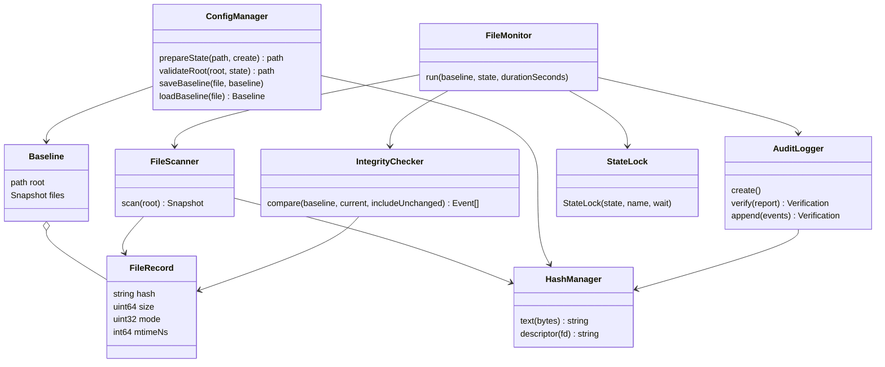

# Class diagram

```mermaid
classDiagram
    class FileRecord {
        string hash
        uint64 size
        uint32 mode
        int64 mtimeNs
    }
    class Baseline {
        path root
        Snapshot files
    }
    class FileScanner {
        scan(root) Snapshot
    }
    class HashManager {
        text(bytes) string
        descriptor(fd) string
    }
    class ConfigManager {
        prepareState(path, create) path
        validateRoot(root, state) path
        saveBaseline(file, baseline)
        loadBaseline(file) Baseline
    }
    class IntegrityChecker {
        compare(baseline, current, includeUnchanged) Event[]
    }
    class AuditLogger {
        create()
        verify(report) Verification
        append(events) Verification
    }
    class FileMonitor {
        run(baseline, state, durationSeconds)
    }
    class StateLock {
        StateLock(state, name, wait)
    }
    Baseline o-- FileRecord
    FileScanner --> HashManager
    FileScanner --> FileRecord
    ConfigManager --> Baseline
    ConfigManager --> HashManager
    IntegrityChecker --> FileRecord
    AuditLogger --> HashManager
    FileMonitor --> FileScanner
    FileMonitor --> IntegrityChecker
    FileMonitor --> AuditLogger
    FileMonitor --> StateLock
```
